# Home Lab Infrastructure Stack
<!-- Project Status -->
[](https://github.com/Jannis510/homelab-infrastructure/actions/workflows/ci.yml)
[](https://github.com/Jannis510/homelab-infrastructure/actions/workflows/security.yml)
[](https://github.com/Jannis510/homelab-infrastructure/releases)
[](https://github.com/Jannis510/homelab-infrastructure/blob/main/LICENSE)

<!-- Core Stack -->
**Core** — DNS, reverse proxy, internal PKI, and SSO\
[](https://github.com/traefik/traefik)
[](https://github.com/pi-hole/pi-hole)
[](https://github.com/NLnetLabs/unbound)
[](https://github.com/smallstep/certificates)
[](https://github.com/authelia/authelia)

<!-- Optional Services -->
**Services** — optional, run independently behind the stack\
[](https://github.com/alam00000/bentopdf)
[](https://github.com/C4illin/ConvertX)
[](https://github.com/nicolargo/glances)
[](https://github.com/gethomepage/homepage)
[](https://github.com/louislam/uptime-kuma)
[](https://github.com/amir20/dozzle)

Docker Compose-based homelab stack for private LAN use. Provides DNS resolution, HTTPS reverse proxy, internal PKI, and SSO for services under `*.app.home.arpa`. No public internet exposure — all access via LAN or VPN only.

---

## How It Works



All traffic enters through exactly two paths: DNS on port 53 and HTTPS on port 443. Everything else is internal. The only ports published to the host network are `53/tcp+udp` (Pi-hole) and `80/tcp + 443/tcp` (Traefik). No service is reachable without going through Traefik, and no request reaches a backend without passing Authelia.

→ [Architecture details](docs/architecture.md)

---

## Stack

| Service | Role | Key property |
|---------|------|-------------|
| **[Pi-hole](https://github.com/pi-hole/pi-hole)** | LAN-wide DNS resolver and ad blocker | Single DNS entry point for all LAN clients |
| **[Unbound](https://github.com/NLnetLabs/unbound)** | Recursive upstream DNS | Resolves directly from root servers — no third-party DNS |
| **[Traefik](https://github.com/traefik/traefik)** | Reverse proxy, HTTPS ingress | File provider only — no Docker socket access |
| **[step-ca](https://github.com/smallstep/certificates)** | Internal PKI, ACME certificate issuance | Isolated in `pki_net`; Traefik is the only ACME client |
| **[Authelia](https://github.com/authelia/authelia)** | SSO and ForwardAuth | Protects every service behind Traefik; login at `auth.app.home.arpa` |

---

## Prerequisites

- Linux host with Docker Engine 24.x+ and Docker Compose v2
- Static LAN IP
- LAN clients configured to use the host as their primary DNS server

---

## Quick Start

### 1. Environment

```bash
cp .env.example .env
```

Set at minimum:
- `SERVER_LOCAL_IP` — static LAN IP of the host
- `PIHOLE_WEBPASSWORD`
- Authelia secrets: `AUTHELIA_SESSION_SECRET`, `AUTHELIA_STORAGE_ENCRYPTION_KEY`, `AUTHELIA_JWT_SECRET`

Generate each Authelia secret with:

```bash
openssl rand -hex 32
```

### 2. step-ca password

```bash
docker run --rm alpine:3.20 sh -lc "apk add --no-cache openssl >/dev/null && openssl rand -base64 32 | tr -d '\n'; echo"
```

Write the output to `config/stepca/password.txt`.

### 3. Authelia users

```bash
cp config/authelia/users_database.yml.example config/authelia/users_database.yml
```

Generate an Argon2id password hash:

```bash
docker run --rm authelia/authelia:4.39 authelia crypto hash generate argon2 --password 'your-password'
```

→ [Authentication details](docs/authelia.md)

### 4. Start

```bash
docker compose --profile init up -d
```

The `--profile init` flag runs `stepca-export` once to write the Root CA bundle to `artifacts/pki/`.
On all subsequent starts, omit the flag — the export is skipped and the existing artifacts are reused:

```bash
docker compose up -d
```

### 5. Trust the Root CA

Install `artifacts/pki/root_ca.crt` into the trust store of all LAN/VPN client devices.

### 6. Configure Router DNS

Set the host's LAN IP as the primary DNS server in your router's DHCP settings to route all LAN DNS queries through Pi-hole.

---

## Configuration

| File | Purpose |
|------|---------|
| [`compose.yml`](compose.yml) | Service orchestration, networks, volumes, ports |
| [`.env`](.env.example) | Runtime settings (IP, passwords, timezone) |
| [`config/traefik/traefik.yml`](config/traefik/traefik.yml) | Static Traefik configuration |
| [`config/traefik/dynamic/*.yml`](config/traefik/dynamic) | Routes, middlewares, backends |
| [`config/stepca/`](config/stepca) | step-ca configuration and password |
| [`config/authelia/configuration.yml`](config/authelia/configuration.yml) | Authelia access policy |
| `config/authelia/users_database.yml` | User accounts *(gitignored)* |

---

## Operations

```bash
docker compose up -d            # start / apply changes
docker compose down             # stop (keep volumes)
docker compose ps               # status
docker compose logs -f          # logs (all services)
docker compose logs -f traefik  # logs (single service)
docker compose restart traefik  # restart single service
```

→ [Volumes, reset, PKI recovery](docs/operations.md)

---

## Optional Services

Services under `services/` run independently from the core stack:

```bash
docker compose -f services/<name>/compose.yml up -d
docker compose -f services/<name>/compose.yml down
```

| Service | URL | Purpose | Compose |
|---------|-----|---------|---------|
| Glances | `https://glances.app.home.arpa` | System metrics | `services/monitoring/` |
| Uptime Kuma | `https://uptime-kuma.app.home.arpa` | Service availability | `services/monitoring/` |
| Dozzle | `https://dozzle.app.home.arpa` | Container logs | `services/monitoring/` |
| Homepage | `https://homepage.app.home.arpa` | Dashboard | `services/homepage/` |
| BentoPDF | `https://bentopdf.app.home.arpa` | PDF tools | `services/bentopdf/` |
| ConvertX | `https://convertx.app.home.arpa` | File format converter | `services/convertx/` |

→ [Adding or removing a service](docs/adding-a-service.md) · [Homepage configuration](docs/homepage.md) · [Monitoring setup](docs/monitoring.md) · [Web tools](docs/tools.md)

---

## CI/CD and Security

GitHub Actions validates Compose configs, lints YAML and shell scripts, and scans for CVEs via Trivy on every push.

→ [Workflow details](docs/github-workflows.md) · [Security exceptions](docs/security-exceptions.md) · [Security model](docs/security.md)

---

## Documentation

| Document | Content |
|----------|---------|
| [Architecture](docs/architecture.md) | Traffic flow, network segmentation, trust zones |
| [Authentication](docs/authelia.md) | Authelia setup, access policy, user management |
| [Operations](docs/operations.md) | Volumes, reset, PKI recovery |
| [Adding a service](docs/adding-a-service.md) | Integration checklist, Traefik routing, DNS |
| [Security](docs/security.md) | Threat model, exposure surface, secret handling |
| [Troubleshooting](docs/troubleshooting.md) | Common issues and fixes |
| [GitHub Workflows](docs/github-workflows.md) | CI/CD pipeline details |
| [Security Exceptions](docs/security-exceptions.md) | Accepted Trivy findings |
| [Homepage](docs/homepage.md) | Dashboard configuration |
| [Monitoring](docs/monitoring.md) | Uptime Kuma, Glances, Dozzle — setup and configuration |
| [Web Tools](docs/tools.md) | BentoPDF and ConvertX |

---

## License

MIT — see [LICENSE](LICENSE).

## Disclaimer

Personal use only. Provided as-is, without warranty of any kind.