# Architecture

## Overview

Clients inside the LAN or connected via VPN use Pi-hole as their primary DNS resolver.
External DNS queries are forwarded to Unbound, which performs recursive resolution.

All HTTPS traffic enters through Traefik, which acts as the single ingress point.
Traefik terminates TLS using certificates issued by the internal step-ca instance via ACME.

Backend services are never exposed directly and are reachable only through Traefik.

---

## Traffic Flow

1. DNS clients query **Pi-hole** (`53/tcp`, `53/udp`).
2. Pi-hole forwards external DNS lookups to **Unbound** (`5335/tcp`, internal only).
3. HTTP(S) traffic enters through **Traefik** (`80/tcp`, `443/tcp`).
4. Traefik requests TLS certificates from **step-ca** via ACME over the internal `pki_net`.
5. Traefik routes requests to backend services (e.g., Pi-hole web UI on container port `80`).

---

## Open Host Ports

The Docker host exposes only the following ports:

* `53/tcp`, `53/udp` → `pihole` (DNS)
* `80/tcp`, `443/tcp` → `traefik` (HTTP/HTTPS ingress)

No other containers are directly published to the host network.

> **Note:** By default, Docker publishes ports on all host interfaces (`0.0.0.0`).
> If the host has multiple network interfaces (LAN, VPN, WAN), bind ports explicitly to the LAN IP or restrict via host firewall rules.

---

## Service Reachability

### Public Internet
No direct exposure. No port forwarding should be configured on the router. Host firewall rules must block inbound WAN traffic.

### LAN / VPN Clients
* DNS: host IP or `pihole.app.home.arpa` (`53/tcp`, `53/udp`)
* HTTPS: `https://traefik.app.home.arpa`, `https://pihole.app.home.arpa`

### Internal-Only Services
* `unbound` — reachable only within `dns_net`
* `stepca` — reachable only within `pki_net`

---

## Docker Network Segmentation

| Network | Services | Purpose |
|---------|----------|---------|
| `dns_net` | `pihole`, `unbound` | DNS resolver chain isolation |
| `proxy_net` | `traefik`, `pihole`, optional services | HTTPS ingress and backend routing |
| `pki_net` | `stepca`, `stepca-export`, `traefik` | Internal PKI and ACME communication |

`pihole` is dual-homed (`dns_net` + `proxy_net`) to connect DNS resolution with web ingress.
`traefik` is dual-homed (`proxy_net` + `pki_net`) to route traffic and request certificates via ACME.

---

## Access Control Model

| Client | Access |
|--------|--------|
| LAN clients | DNS and HTTPS ingress |
| VPN clients | Same as LAN |
| Public internet | None |

All services behind Traefik are protected by Authelia (ForwardAuth). Login portal: `https://auth.app.home.arpa`.

---

## Trust Zones

1. **client_zone** — LAN and VPN clients
2. **dns_net** — Resolver path, isolated DNS processing
3. **proxy_net** — HTTPS ingress, backend service routing
4. **pki_net** — ACME certificate issuance, internal PKI boundary

Clear zone separation minimizes lateral movement and cross-service exposure.

---

## Design Rationale

* Explicit port exposure (minimal surface area)
* Network segmentation via dedicated Docker networks
* Reverse proxy as the single HTTPS entrypoint
* Internal PKI instead of ad-hoc self-signed certificates
* No public-facing services
* Traefik runs without Docker socket access — compromise of Traefik does not grant host control